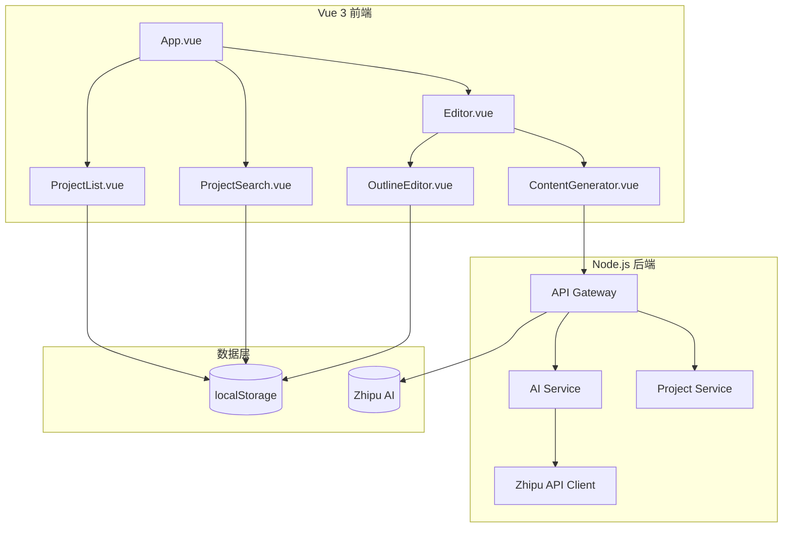
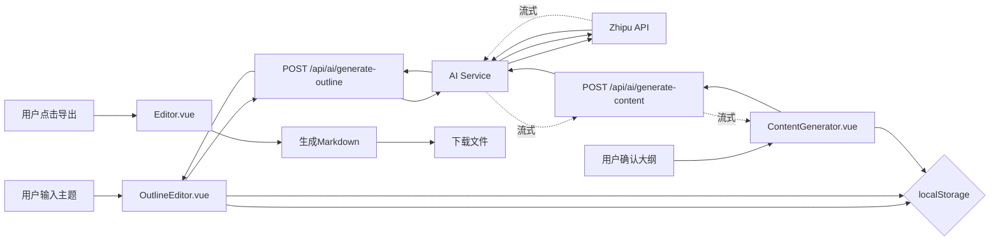

# AI文章生成工作台 - 系统设计文档

## 1. 整体架构



## 2. 分层设计

### 2.1 前端组件结构

| 组件 | 职责 | 状态管理 |
|-----|------|---------|
| App.vue | 主布局容器 | 项目列表状态 |
| ProjectList.vue | 项目列表展示与管理 | localStorage |
| ProjectSearch.vue | 项目搜索框 | 搜索关键词 |
| Editor.vue | 文章编辑器主页面 | 当前项目状态 |
| OutlineEditor.vue | 大纲编辑组件 | 大纲数据 |
| ContentGenerator.vue | 正文生成组件 | 正文内容 |

### 2.2 后端模块结构

| 模块 | 职责 | 文件路径 |
|-----|------|---------|
| API Gateway | 路由与请求处理 | server/routes/ |
| AI Service | AI调用封装 | server/services/aiService.js |
| Project Service | 项目数据管理 | server/services/projectService.js |
| Zhipu Client | Zhipu API封装 | server/clients/zhipuClient.js |

## 3. 接口契约定义

### 3.1 后端API接口

#### POST /api/ai/generate-outline
- **功能**: 生成文章大纲
- **输入**: `{ "topic": string }`
- **输出**: `{ "success": true, "data": { "outline": string[] } }`
- **失败**: `{ "success": false, "error": string }`

#### POST /api/ai/generate-content
- **功能**: 流式生成正文内容
- **输入**: `{ "outline": string[], "currentSection": number }`
- **输出**: 流式响应，逐块返回内容

#### POST /api/ai/rewrite
- **功能**: 润色/扩写/缩写
- **输入**: `{ "content": string, "action": "polish" | "expand" | "shorten" }`
- **输出**: `{ "success": true, "data": { "content": string } }`

### 3.2 前端状态结构

```typescript
interface Project {
  id: string
  title: string
  topic: string
  outline: string[]
  content: Record<number, string>
  createdAt: number
}

interface EditorState {
  currentProject: Project | null
  isGenerating: boolean
  currentSection: number
}
```

## 4. 数据流向



## 5. 异常处理策略

| 异常场景 | 处理方式 | 用户提示 |
|---------|---------|---------|
| AI服务调用失败 | 重试2次后返回错误 | "生成失败，请稍后重试" |
| 网络超时 | 取消请求，显示错误 | "网络超时，请检查网络连接" |
| 大纲为空 | 禁用生成按钮 | "请先生成大纲" |
| localStorage不可用 | 提示用户 | "浏览器存储不可用" |

## 6. 设计规范

- 主题色: Stripe靛蓝（设计系统规范中AI应用推荐）
- 响应式: 支持桌面端和移动端
- 动画: 平滑过渡，无bounce效果
- 卡片: 应用3D倾斜效果（最大3度）