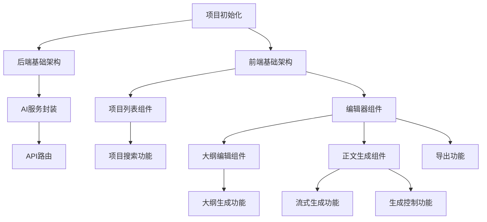

# AI文章生成工作台 - 任务拆分文档

## 1. 任务依赖关系图

## 2. 原子任务清单

### 任务1: 项目初始化
- **负责人**: 前后端协作
- **输入**: 空项目目录
- **输出**: 
  - 前端Vue项目结构
  - 后端Node.js项目结构
  - 安装必要依赖
- **依赖**: 无
- **验收标准**: 
  - 前端可正常启动开发服务器
  - 后端可正常启动

### 任务2: 后端基础架构
- **负责人**: @backend
- **输入**: 空后端目录
- **输出**: 
  - Express服务器配置
  - 环境变量配置
  - 基础中间件设置
- **依赖**: 任务1
- **验收标准**: 服务器可正常启动，返回健康检查接口

### 任务3: AI服务封装
- **负责人**: @backend
- **输入**: 后端基础架构
- **输出**: 
  - Zhipu API客户端封装
  - AI服务模块（生成大纲、生成正文、改写）
- **依赖**: 任务2
- **验收标准**: 可成功调用Zhipu API

### 任务4: API路由
- **负责人**: @backend
- **输入**: AI服务模块
- **输出**: 
  - /api/ai/generate-outline POST接口
  - /api/ai/generate-content POST接口（流式）
  - /api/ai/rewrite POST接口
- **依赖**: 任务3
- **验收标准**: 接口可正常响应，返回正确格式

### 任务5: 前端基础架构
- **负责人**: @frontend
- **输入**: 空前端目录
- **输出**: 
  - Vue 3 + Vite项目配置
  - TailwindCSS 3配置
  - 设计系统主题变量
- **依赖**: 任务1
- **验收标准**: 前端样式正常，设计系统变量可使用

### 任务6: 项目列表组件
- **负责人**: @frontend
- **输入**: 前端基础架构
- **输出**: 
  - ProjectList.vue组件
  - localStorage存储逻辑
  - 项目增删改功能
- **依赖**: 任务5
- **验收标准**: 项目列表可正常展示、新增、删除

### 任务7: 项目搜索功能
- **负责人**: @frontend
- **输入**: 项目列表组件
- **输出**: ProjectSearch.vue组件，支持关键词搜索
- **依赖**: 任务6
- **验收标准**: 可实时搜索过滤项目列表

### 任务8: 编辑器组件
- **负责人**: @frontend
- **输入**: 前端基础架构
- **输出**: 
  - Editor.vue主编辑器组件
  - 项目状态管理
- **依赖**: 任务5
- **验收标准**: 编辑器页面正常显示

### 任务9: 大纲编辑组件
- **负责人**: @frontend
- **输入**: 编辑器组件
- **输出**: 
  - OutlineEditor.vue组件
  - 大纲展示与编辑功能
- **依赖**: 任务8
- **验收标准**: 大纲可正常编辑

### 任务10: 大纲生成功能
- **负责人**: @frontend + @backend
- **输入**: 大纲编辑组件 + AI服务
- **输出**: 点击按钮调用后端生成大纲
- **依赖**: 任务4、任务9
- **验收标准**: 输入主题可生成大纲并展示

### 任务11: 正文生成组件
- **负责人**: @frontend
- **输入**: 编辑器组件
- **输出**: 
  - ContentGenerator.vue组件
  - 流式内容展示
- **依赖**: 任务8
- **验收标准**: 流式内容正常渲染

### 任务12: 流式生成功能
- **负责人**: @frontend + @backend
- **输入**: 正文生成组件 + AI服务
- **输出**: 逐段流式生成正文内容
- **依赖**: 任务4、任务11
- **验收标准**: 流式输出流畅，内容正确

### 任务13: 生成控制功能
- **负责人**: @frontend
- **输入**: 正文生成组件
- **输出**: 暂停/继续/重新生成/润色/扩写/缩写功能
- **依赖**: 任务12
- **验收标准**: 各控制按钮功能正常

### 任务14: 导出功能
- **负责人**: @frontend
- **输入**: 编辑器组件
- **输出**: 导出Markdown文件（带YAML front matter）
- **依赖**: 任务8
- **验收标准**: 可下载正确格式的Markdown文件

## 3. 任务优先级

| 优先级 | 任务 | 说明 |
|-------|------|-----|
| P0 | 任务1-5 | 基础架构，必须先完成 |
| P1 | 任务6-10 | 核心功能，大纲生成 |
| P2 | 任务11-14 | 进阶功能，正文生成与导出 |

## 4. 并行任务说明

- 任务2-4（后端）与任务5-8（前端）可并行开发
- 任务10、12需要前后端联调，需同步完成